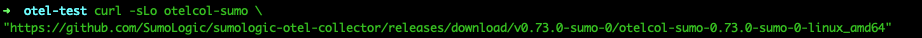
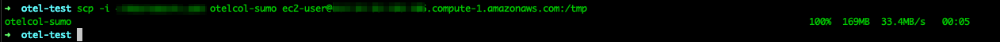
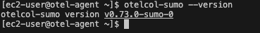

# Sumo Logic OpenTelemetry agent in a "secure" (non-internet-facing) network

## The purpose of this readme is to configure a Sumo Logic Open Telemetry (otel) collector as an agent (i.e., gather local files from the machine it is on and send it to a gateway in a DMZ network). If you are looking to configure the gateway on a DMZ network please see [here](/gateway-config.md). 

#### Step 1 - Install the collector
- Because this collector will not have an internet connection, we will be downloading the files to a machine in the DMZ network and then copying them via SCP to the machine we are wanting to collect from. We will follow this [documentation](https://help.sumologic.com/docs/send-data/opentelemetry-collector/install-collector-linux/#manual-step-by-step-installation)
    - *In this example, my agent is a RHEL machine and my gateway is Debian based* 

- Download the collector to your dmz machine


- SCP the file to your secure machine 


#### Step 2. Move the binary to your `PATH` environment

Move the downloaded binary into a directory from your `PATH` environment, so that it can be used by simply invoking `otelcol-sumo`.

```bash
chmod +x otelcol-sumo
sudo mv otelcol-sumo /usr/local/bin/otelcol-sumo
```

#### Step 3. Verify the Installation

To verify installation, run the OpenTelemetry Collector.

```bash
otelcol-sumo --version
```
- Example output



**IMPORTANT prerequisites**
Ensure that the user who will run the `otelcol-sumo` process has access to any directories used in your configuration within the filesystem.

For example, if you use the [file_storage extension](https://github.com/open-telemetry/opentelemetry-collector-contrib/tree/main/extension/storage/filestorage) in your configuration like this:

```yaml
extensions:
file_storage/custom_settings:
directory: /var/lib/otelcol/mydir
timeout: 1s
```

Then the user running the process must have access to `/var/lib/otelcol/mydir`.

To run OpenTelemetry Collector as Systemd Service, follow the steps below:

1. Ensure that `otelcol-sumo` has been installed into `/usr/local/bin/otelcol-sumo` by running this command.
   ```bash
   /usr/local/bin/otelcol-sumo --version
   ```
1. Create configuration, follow the steps below.
   1. Create your custom configuration file in the `/etc/otelcol-sumo/conf.d` directory. In this example, we will create a file called `files.yaml` in this directory to store our custom configuration, like this `/etc/otelcol-sumo/conf.d/files.yaml`. This configuration will focus on collecting specific log files in a directory. 
        - *It is recommended to limit access to the configuration file as it contains sensitive information.*
    1. Create your files.yaml with the yaml below: 
        ```yaml 
        exporters:
        logging:
            verbosity: detailed
            sampling_initial: 5
            sampling_thereafter: 200
        otlp/2:
            endpoint: GATEWAY_IP:4317
            tls:
            insecure: true

        receivers:
        filelog:
            start_at: beginning
            include:
            # Example file path. Update to fit your needs
            - /tmp/testlogs/*.txt

        service:
        pipelines:
            logs:
            receivers:
                - filelog
            exporters:
                - otlp/2
                - logging
        ```
   1. You can change the access permissions to the configuration file by running the following command:
    ```bash
    sudo mkdir -p /etc/otelcol-sumo/{conf.d,env}
    sudo chmod 551 /etc/otelcol-sumo /etc/otelcol-sumo/{conf.d,env}
    sudo chmod 440 /etc/otelcol-sumo/conf.d/files.yaml
    ```
1. Create `user` and `group` to run OpenTelemetry by running the following command:
   ```bash
   sudo useradd -mrUs /bin/false -d /var/lib/otelcol-sumo otelcol-sumo
   ```

1. Change the ownership of the /etc/otelcol-sumo folder to be owned by the new user we just created: 
    ```bash
    sudo chown -R otelcol-sumo:otelcol-sumo /etc/otelcol-sumo/
    ```

1. Ensure that the configuration can be accessed by `otelcol-sumo` user which will be used to run the service by running this command.
   ```bash
    $ sudo find /etc/otelcol-sumo/ -type 'f' | sudo xargs ls -al
    -r--r-----. 1 otelcol-sumo otelcol-sumo 380 Aug 30 16:43 /etc/otelcol-sumo/conf.d/files.yaml
    ```

1. Verify if OpenTelemetry collector runs without errors by running this command:
   ```bash
   $ sudo su -s /bin/bash otelcol-sumo -c '/usr/local/bin/otelcol-sumo --config /etc/otelcol-sumo/conf.d/files.yaml'
    2023-08-30T16:58:00.453Z        info    service/telemetry.go:90 Setting up own telemetry...
   ```

1. Create a service file and save it as `/etc/systemd/system/otelcol-sumo.service`
    ```bash
    [Unit]
    Description=Sumo Logic Distribution for OpenTelemetry Collector

    [Service]
    ExecStart=/usr/local/bin/otelcol-sumo --config /etc/otelcol-sumo/conf.d/files.yaml
    User=otelcol-sumo
    Group=otelcol-sumo
    MemoryHigh=2000M
    MemoryMax=3000M
    TimeoutStopSec=20

    [Install]
    WantedBy=multi-user.target
    ```
    - Please adjust memory configuration to meet your needs

1. Enable autostart of the service by running the following command:
   ```bash
   sudo systemctl enable otelcol-sumo
   ```
1. Because this is a RHEL Machine, if your SELinux Policy is enabled you may need to do additional steps: 
    - Validate if SELinux is turned on: 
    ```bash
    getenforce
    ```
    - If SELinux is enabled, please run the following command to update the policy to allow our service to run: 
    ```bash
    sudo chcon -t bin_t /usr/local/bin/otelcol-sumo
    ```
   
1. Start service and check status by running the following command:
   ```bash
   sudo systemctl start otelcol-sumo
   sudo systemctl status otelcol-sumo  # checks status
   sudo journalctl -u otelcol-sumo  # checks logs
   ```